# SkillHub — AI-Powered Skills Intelligence Platform

> A hackathon project that eliminates manual skill mapping. Employees upload a resume PDF → AI extracts every skill, project, and certification → HR searches talent in natural language.

---

## Table of Contents

1. [Project Overview](#1-project-overview)
2. [Tech Stack](#2-tech-stack)
3. [Architecture](#3-architecture)
4. [Database Schema](#4-database-schema)
5. [Feature Walkthrough](#5-feature-walkthrough)
   - [Authentication](#51-authentication)
   - [Employee — Resume Upload](#52-employee--resume-upload)
   - [Employee — Dashboard & Profile](#53-employee--dashboard--profile)
   - [HR — Review Queue](#54-hr--review-queue)
   - [HR — AI Talent Search](#55-hr--ai-talent-search)
   - [HR — Employee Directory](#56-hr--employee-directory)
   - [HR — Employee Detail Page](#57-hr--employee-detail-page)
   - [HR — Approved Profiles](#58-hr--approved-profiles)
   - [HR — Dashboard](#59-hr--dashboard)
6. [Setup & Installation](#6-setup--installation)
7. [Environment Variables](#7-environment-variables)
8. [API Reference](#8-api-reference)
9. [AI Pipeline](#9-ai-pipeline)
10. [Profile Lifecycle](#10-profile-lifecycle)
11. [Folder Structure](#11-folder-structure)
12. [Demo Credentials](#12-demo-credentials)

---

## 1. Project Overview

SkillHub solves a real enterprise problem: HR teams waste hours manually maintaining skill matrices. With SkillHub:

- **Employees** upload their resume PDF once
- **Groq + Llama-3.3-70b** automatically extracts skills, projects, certifications, LinkedIn URL, and infers related skills
- **HR** reviews the AI extraction before it goes live (human-in-the-loop)
- **HR** searches talent using plain English: *"Who can lead a React project with WebSocket experience in Pune?"*
- The AI returns **ranked candidates with match scores and explanations**

---

## 2. Tech Stack

| Layer | Technology |
|---|---|
| Framework | Next.js 14 (App Router, TypeScript) |
| Styling | Tailwind CSS + Radix UI primitives |
| Auth | NextAuth.js v4 — JWT, role-based (HR / EMPLOYEE) |
| ORM | Prisma v5 |
| Database | SQLite (zero-config, file-based) |
| AI — Extraction | Groq SDK · `llama-3.3-70b-versatile` |
| AI — Search | Groq SDK · `llama-3.3-70b-versatile` (re-ranking) |
| PDF Parsing | `pdf-parse` npm package + `pdftotext` binary |
| Icons | Lucide React |

---

## 3. Architecture

```
Browser
  │
  ▼
Next.js 14 App Router
  ├── (auth)/          ← Public: Login, Register, Forgot Password
  ├── (employee)/      ← Protected: Employee dashboard, profile, resume upload
  └── (hr)/            ← Protected: HR dashboard, search, directory, review queue
        │
  API Routes (/api/*)
        │
  ┌─────┴──────────────────────────────────┐
  │              Prisma ORM                │
  │           SQLite Database              │
  └─────────────────────────────────────────┘
        │
  ┌─────┴──────────┐
  │   Groq SDK     │
  │ llama-3.3-70b  │
  │ • Resume parse │
  │ • Skill infer  │
  │ • NL search    │
  └────────────────┘
```

**Request flow for Resume Upload:**
```
Employee uploads PDF
  → /api/resume/extract
  → pdf-parse extracts raw text
  → Groq: extractProfileFromResume(text)
  → Returns JSON: skills + projects + certs + LinkedIn URL
  → Apply inference rules (Next.js → React inferred)
  → Save as Profile{status: PENDING}
  → HR sees it in Review Queue
  → HR approves → skills written to live Employee tables
```

**Request flow for AI Search:**
```
HR types query
  → POST /api/search
  → Groq: semanticSearch(query)      [approved employees]
  → Groq: semanticSearchPending(query) [pending profiles]
  → Sequential (not parallel) → avoids Groq rate limits
  → Dedup: employees with pending profile excluded from approved results
  → Return ranked results with match scores + reasoning
```

---

## 4. Database Schema

```
User
├── id, email, password, role (HR | EMPLOYEE)
└── employee → Employee

Employee
├── id, userId, name, email
├── department, location, designation
├── currentProject, bio, linkedinUrl
├── skills    → EmployeeSkill[]
├── projects  → Project[]
├── certifications → Certification[]
└── profiles  → Profile[]

Profile
├── id, employeeId, status (PENDING | APPROVED | REJECTED)
├── source (RESUME | MANUAL | LINKEDIN)
├── rawText        ← original PDF text
├── extractedData  ← JSON: AI-extracted skills/projects/certs
├── reviewNotes    ← HR note on reject/approve
├── approvedBy     ← HR name who approved
└── embedding      ← (reserved for vector search)

EmployeeSkill
├── employeeId, skillId
├── proficiency (NOVICE | INTERMEDIATE | EXPERT)
├── yearsExp (float)
└── inferred (bool) ← auto-inferred from skill rules

Skill
├── id, name (unique)
└── category (LANGUAGE | FRAMEWORK | PLATFORM | TOOL | DOMAIN)

Project
├── employeeId, name, description, role
├── techStack (JSON array stored as string)
└── startDate, endDate

Certification
├── employeeId, name, issuer, issueDate
```

---

## 5. Feature Walkthrough

### 5.1 Authentication

**Pages:** `/login` · `/register` · `/forgot-password`

- Employees and HR both use the same login form
- Role is set during registration (`EMPLOYEE` default, `HR` requires manual DB assignment or seeding)
- Passwords hashed with `bcryptjs`
- Session is JWT-based — `session.user.role` gates all protected routes

**Screenshot — Login Page:**

```
┌─────────────────────────────────────────┐
│            SkillHub Login               │
│  ┌───────────────────────────────────┐  │
│  │  Email                            │  │
│  └───────────────────────────────────┘  │
│  ┌───────────────────────────────────┐  │
│  │  Password                         │  │
│  └───────────────────────────────────┘  │
│  [ Sign In ]    Forgot password?        │
│                                         │
│  Don't have an account? Register        │
└─────────────────────────────────────────┘
```

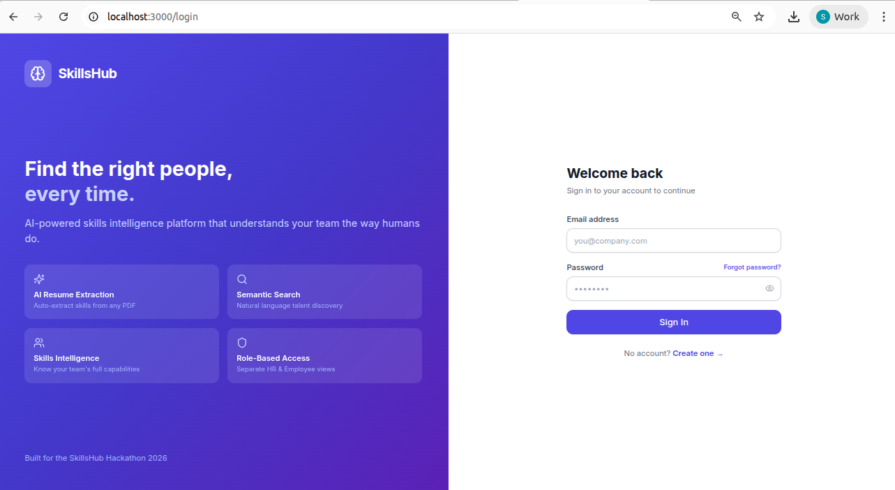

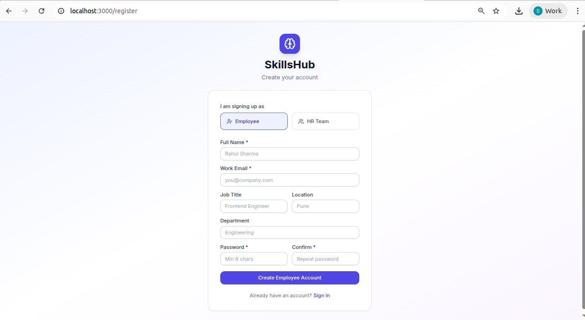

---

### 5.2 Employee — Resume Upload

**Page:** `/employee/upload`

**Steps:**
1. Employee drags & drops or selects a PDF resume
2. `pdf-parse` extracts raw text server-side
3. Groq `llama-3.3-70b-versatile` parses the text and returns structured JSON
4. Inference engine adds related skills (e.g., if `Next.js` found → auto-add `React`, `JavaScript`)
5. Profile saved as `PENDING` — **old pending profiles are deleted** to prevent duplicate queue entries
6. Employee sees "Profile under review" status until HR acts

**Inference rules (selected):**

| Detected Skill | Inferred Skills                |
|----------------|--------------------------------|
| Next.js        | React, JavaScript              |
| TypeScript     | JavaScript                     |
| Spring Boot    | Java                           |
| FastAPI        | Python                         |
| Kubernetes     | Docker, DevOps                 |

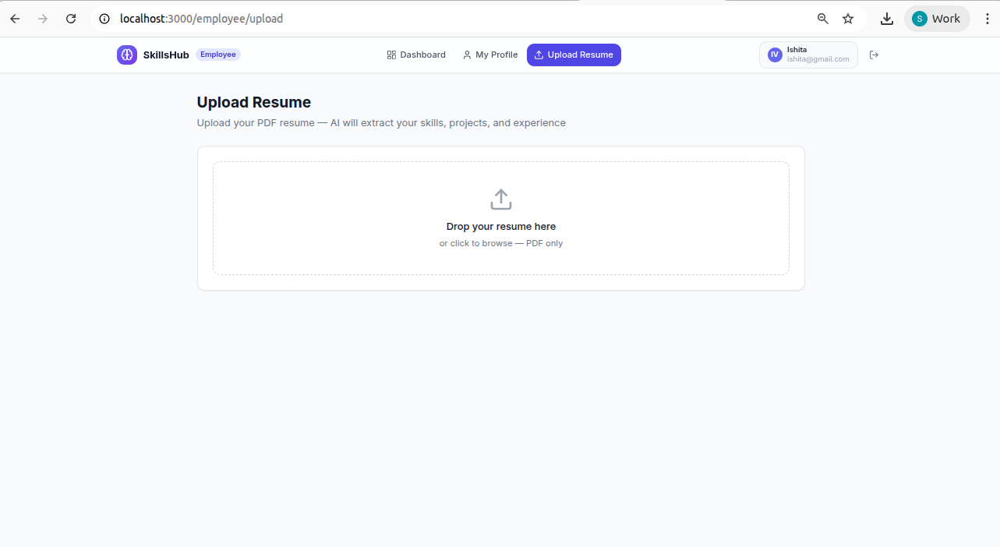

```
┌─────────────────────────────────────────┐
│          Upload Your Resume             │
│                                         │
│  ┌ ─ ─ ─ ─ ─ ─ ─ ─ ─ ─ ─ ─ ─ ─ ─ ┐      │
│      Drag & Drop PDF here               │
│      or click to browse                 │
│  └ ─ ─ ─ ─ ─ ─ ─ ─ ─ ─ ─ ─ ─ ─ ─ ┘      │
│                                         │
│  ✓ Extracts skills automatically        │
│  ✓ Detects years of experience          │
│  ✓ Identifies projects & certifications │
└─────────────────────────────────────────┘
```

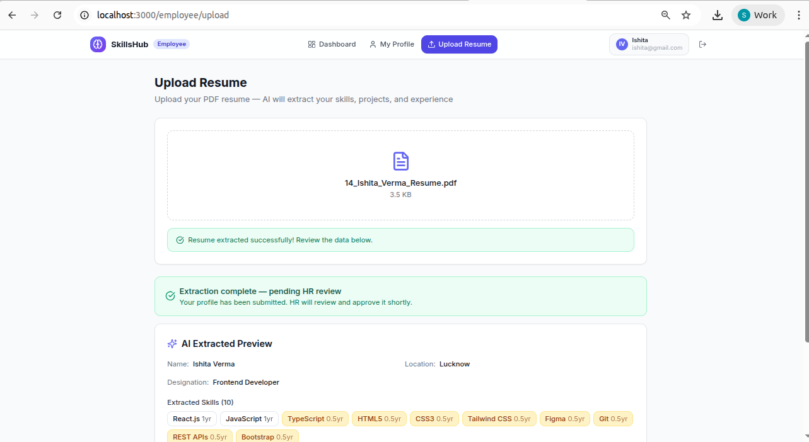

---

### 5.3 Employee — Dashboard & Profile

**Pages:** `/employee/dashboard` · `/employee/profile`

**What employees see:**
- **Approved profile** → full skills, projects, certifications, LinkedIn link
- **Pending profile** → amber "Under Review" banner + preview of extracted data
- **Rejected profile** → red banner with HR's rejection note (or default message) + extracted data still visible so they know what to fix
- **No resume** → prompt to upload

The key UX decision: **rejected employees can still see their extracted data** — they know exactly what skills were found, so they can improve their resume without guessing.

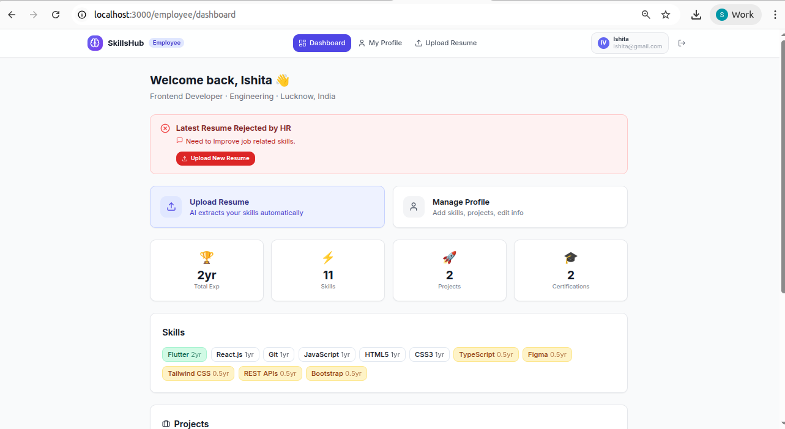

```
┌──────────────────────────────────────────────────┐
│ 🔴 Profile Rejected                              │
│ HR note: "Skillset doesn't match current roles"  │
│ [ Upload New Resume ]                            │
├──────────────────────────────────────────────────┤
```

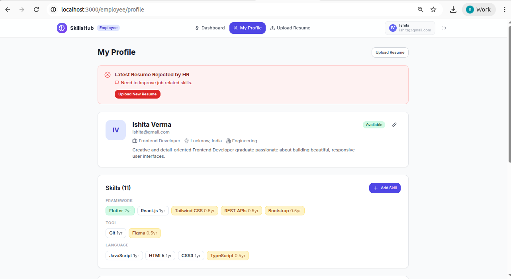


---

### 5.4 HR — Review Queue

**Page:** `/hr/review-queue`

The review queue is the **human-in-the-loop checkpoint**. AI extraction is never automatically applied to live profiles without HR sign-off.

**HR actions per profile:**
1. Click **Review** to expand the card
2. See extracted: name, location, designation, LinkedIn URL, all skills with proficiency/years, inferred skills, projects with tech stack, certifications
3. Add optional review notes
4. Click **Approve & Apply to Profile** — writes skills/projects/certs to live Employee tables, saves `approvedBy` HR name, saves LinkedIn URL
5. Or click **Reject** — marks profile as REJECTED, sends note to employee

**Deduplication:** If an employee uploads a new resume, the old PENDING profile is deleted before creating the new one — the HR queue never shows the same employee twice.

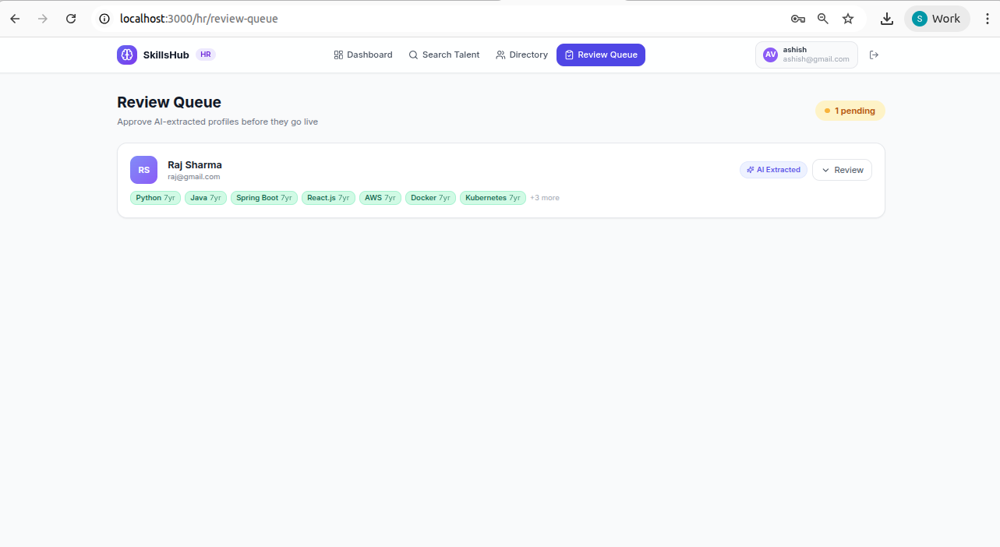

```
┌────────────────────────────────────────────────────┐
│  Review Queue                      ● 3 pending     │
├────────────────────────────────────────────────────┤
│  Rahul Sharma           [AI Extracted] [▼ Review]  │
│  [React·EXPERT] [Node.js·INTERMEDIATE] +4 more     │
├────────────────────────────────────────────────────┤
│  ▼ Expanded Review Panel                           │
│  Name: Rahul Sharma    Location: Pune              │
│  Designation: Full Stack Developer                 │
│  🔗 linkedin.com/in/rahulsharma                   │
│                                                    │
│  Skills (12)                                       │
│  [React·5yr] [Node.js·3yr] [MongoDB·2yr] ...      │
│                                                    │
│  ✨ Inferred Skills                                │
│  [JavaScript·INTERMEDIATE] [Express·NOVICE]        │
│                                                    │
│  Projects (3)                                      │
│  ● Rezopay — Payment gateway [React, Node, Stripe] │
│                                                    │
│  Review Notes: ________________________            │
│  [ ✓ Approve & Apply ] [ ✗ Reject ]               │
└────────────────────────────────────────────────────┘
```

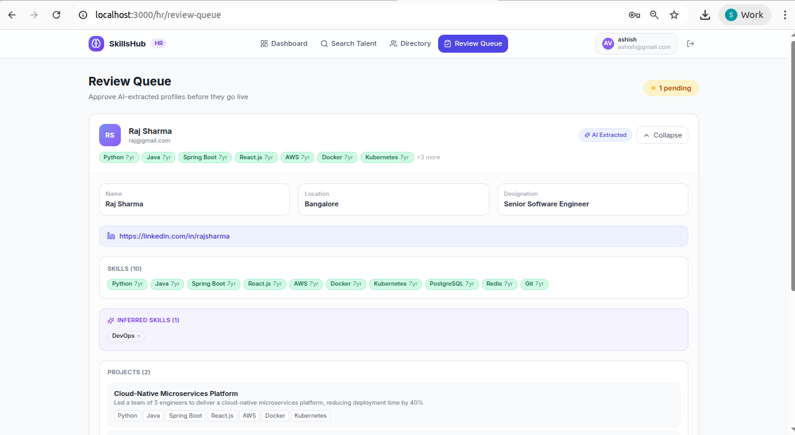

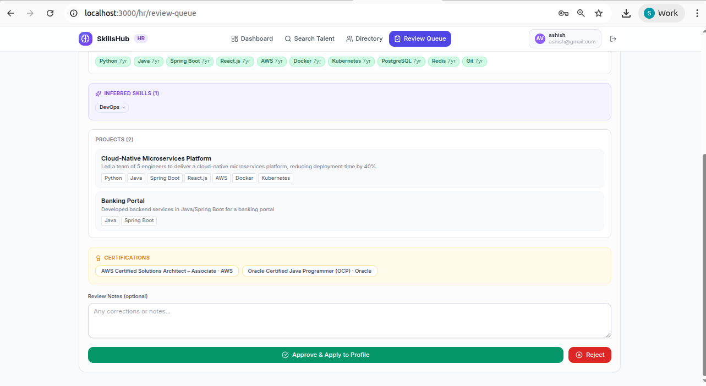

---

### 5.5 HR — AI Talent Search

**Page:** `/hr/search`

The most powerful feature. HR types any natural language query and the AI returns ranked candidates with explanations.

**How it works:**
1. Query sent to `POST /api/search`
2. **Approved employees** summarized (skills, projects, certs, location, availability) and sent to Groq for ranking
3. **Pending profiles** also ranked separately (from `extractedData`) — sequential calls to avoid rate limits
4. Employees with a pending profile are excluded from approved results (no double-listing)
5. Results show: match score (0–100), AI reasoning, top skills, availability status

**Example queries the system handles:**
- `"Who can lead a React project with WebSocket experience?"`
- `"Backend dev in Pune with 3+ years of Java and payment gateway experience"`
- `"Senior frontend engineers who are currently unallocated"`
- `"DevOps engineer with Kubernetes and AWS expertise"`

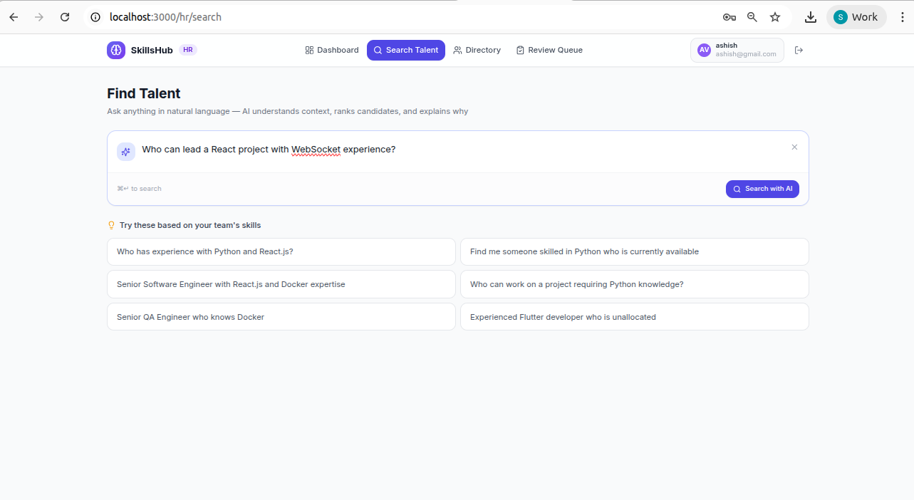

```
┌──────────────────────────────────────────────────┐
│  Find Talent                                     │
│  ┌──────────────────────────────────────────┐    │
│  │ ✨ Who can lead a React project...        │    │
│  │                              [ Search ]  │    │
│  └──────────────────────────────────────────┘    │
├──────────────────────────────────────────────────┤
│  3 approved candidates found · 1 pending         │
├────┬─────────────────────────────────────────────┤
│ #1 │ Rahul Sharma          [Available]           │
│ 92 │ Full Stack · Pune                           │
│    │ ✨ 5yr React experience, worked on real-time│
│    │    projects using Socket.IO and WebSockets  │
│    │ [React·5yr] [Socket.IO·2yr] [Node.js·3yr]  │
├────┼─────────────────────────────────────────────┤
│ #2 │ Priya Mehta           [On project]          │
│ 74 │ Frontend · Mumbai                           │
│    │ ✨ Strong React skills, some WebSocket use  │
│    │ [React·3yr] [TypeScript·2yr] [Vue·1yr]      │
└────┴─────────────────────────────────────────────┘
│  ⏳ Pending Review — 1 potential match           │
│  → Ananya Iyer [Review]                          │
└──────────────────────────────────────────────────┘
```

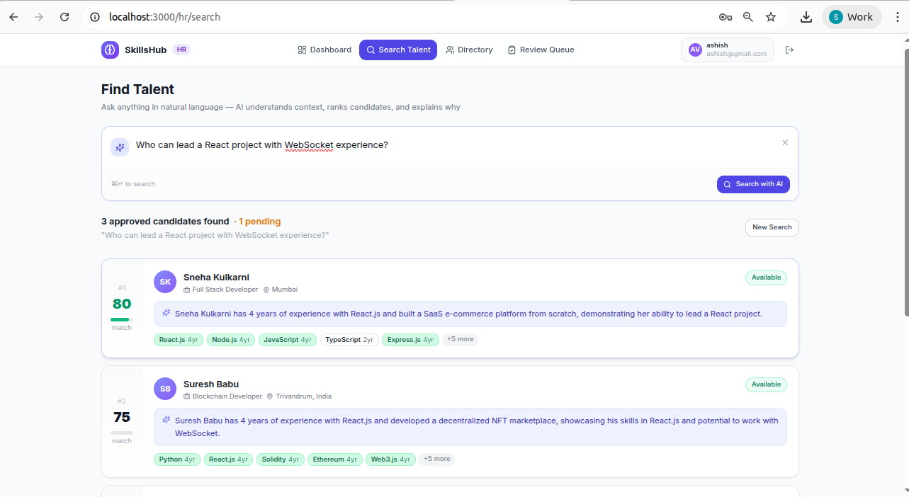

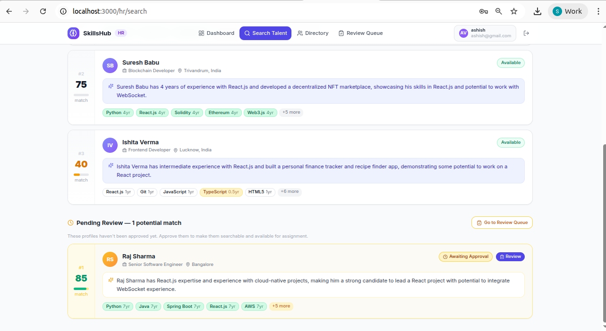

---

### 5.6 HR — Employee Directory

**Page:** `/hr/employees`

Lists all employees grouped into four sections by profile status:


**Skills display logic per card:**
- If employee has **live approved skills** → show those
- Else → show extracted skills from latest profile with **"from resume"** tag

Search bar filters by name, skill, location, or designation using the `/api/employees?search=` endpoint.


```
┌──────────────────────────────────────────────────┐
│  Employee Directory          12 employees total  │
│  [ 🔍 Search by name, skill, location… ]         │
├──────────────────────────────────────────────────┤
│  ✅ Approved Profiles                 7 employees│
│  ┌──────────────┐ ┌──────────────┐ ┌──────────┐  │
│  │ RS Rahul     │ │ PM Priya     │ │ AK Arjun │  │
│  │ Full Stack   │ │ Frontend Dev │ │ Backend  │  │
│  │ [React][Node]│ │ [Vue][TypeSc]│ │ [Java]   │  │
│  └──────────────┘ └──────────────┘ └──────────┘  │
├──────────────────────────────────────────────────┤
│  ⏳ Pending Review                    2 employees│
│  ┌──────────────┐ ┌──────────────┐               │
│  │ AI Ananya    │ │ DG Deepak    │               │
│  │ ML Engineer  │ │ DevOps       │               │
│  │ [Python]from │ │ [K8s] from   │               │
│  │ resume       │ │ resume       │               │
│  └──────────────┘ └──────────────┘               │
├──────────────────────────────────────────────────┤
│  ❌ Rejected Profiles                 2 employees│
│  ┌──────────────┐ ┌──────────────┐               │
│  │ KS Kavita    │ │ RS Rahul D.  │               │
│  │ [React] from │ │ [Angular]from│               │
│  │ resume       │ │ resume       │               │
│  └──────────────┘ └──────────────┘               │
└──────────────────────────────────────────────────┘
```

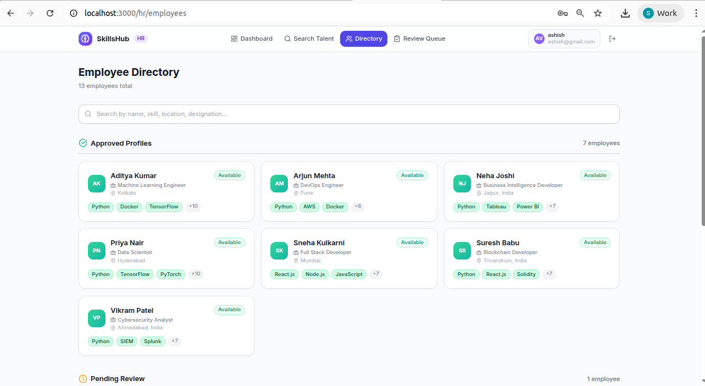

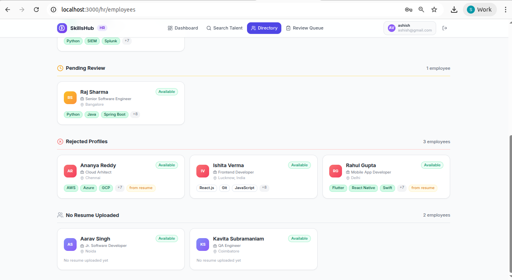

---

### 5.7 HR — Employee Detail Page

**Page:** `/hr/employees/[id]`

Shows the full profile of any employee. The page adapts based on profile status:

**Approved employee:**
- No banner, full skills by category (LANGUAGE / FRAMEWORK / PLATFORM / TOOL / DOMAIN), live projects, certifications, LinkedIn link

**Pending employee:**
- Amber banner: "Profile Pending Review"
- Skills/projects/certs shown from `extractedData` with "From pending resume" tag

**Rejected employee:**
- Red banner with HR rejection note
- Skills/projects/certs shown from `extractedData` with "From rejected resume" tag

**No resume:**
- Gray banner: "This employee has not uploaded a resume yet"

The colored stripe at the top of the header card changes color (green/amber/red/gray) to match the status at a glance.


```
┌──────────────────────────────────────────────────┐
│ 🔴 Profile Rejected                              │
│ HR note: "Skillset doesn't match current roles"  │
├──────────────────────────────────────────────────┤
│ ════════════════════ (red stripe)                │
│  KS   Kavita Subramaniam                         │
│       kavita@company.com                         │
│       💼 Data Analyst · 📍 Chennai               │
│       🔗 linkedin.com/in/kavitas                 │
│  [Available]                                     │
│                                                  │
│  Skills: 8  Projects: 2  Certifications: 1       │
├──────────────────────────────────────────────────┤
│  Skills  [From rejected resume]                  │
│  [Python·EXPERT] [SQL·INTERMEDIATE] [Tableau·2yr]│
│                                                  │
│  Projects  [From rejected resume]                │
│  ● Sales Dashboard — Python, Tableau, PostgreSQL │
│                                                  │
│  Certifications  [From rejected resume]          │
│  🏆 Google Data Analytics · Coursera             │
└──────────────────────────────────────────────────┘
```

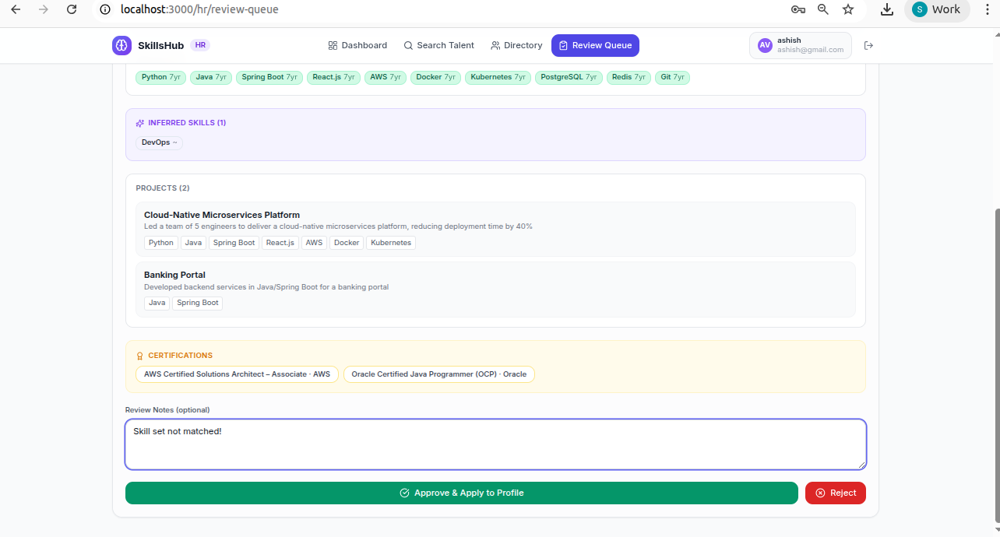

---

### 5.8 HR — Approved Profiles

**Page:** `/hr/approved-profiles`

A dedicated page listing all profiles that have been approved, showing:
- Employee name, designation, location
- Top skills extracted from their resume
- Which HR user approved the profile and when
- Footer summary of approvals per HR user

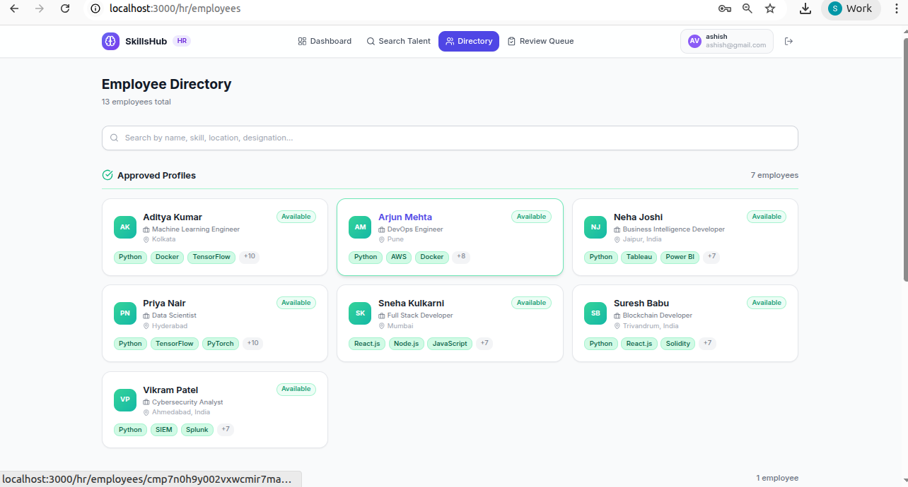

```
┌──────────────────────────────────────────────────┐
│  Approved Profiles                    7 approved  │
├──────────────────────────────────────────────────┤
│  RS  Rahul Sharma                                │
│      Full Stack Developer · Pune                 │
│      [React·5yr] [Node.js·3yr] [MongoDB·2yr]    │
│      ✅ Approved by NP Neha Patil · 3 days ago  │
├──────────────────────────────────────────────────┤
│  PM  Priya Mehta                                 │
│      Frontend Developer · Mumbai                 │
│      [Vue·3yr] [TypeScript·2yr]                  │
│      ✅ Approved by NP Neha Patil · 5 days ago  │
├──────────────────────────────────────────────────┤
│  Approved by HR:                                 │
│  NP Neha Patil — 7 profiles approved            │
└──────────────────────────────────────────────────┘
```


---

### 5.9 HR — Dashboard

**Page:** `/hr/dashboard`

At-a-glance stats for HR managers:


Below the stats: recent activity feed (latest profile submissions and approvals).


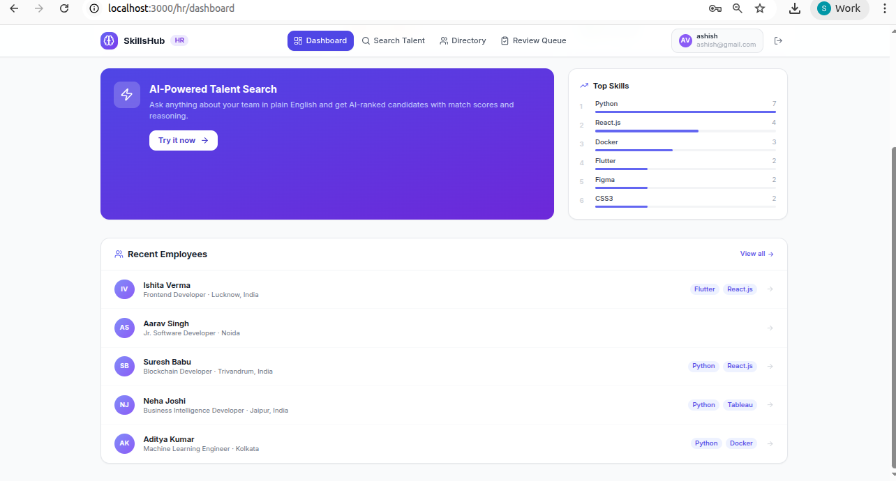

```
┌──────────────────────────────────────────────────┐
│  Welcome back, Neha Patil 👋                     │
│  SkillHub HR Portal                              │
├────────────┬───────────┬───────────┬─────────────┤
│  12        │  7        │  3        │  48         │
│  Employees │ Approved  │ Pending   │ Skills      │
│  (indigo)  │ (emerald) │ (amber)   │ (purple)    │
└────────────┴───────────┴───────────┴─────────────┘
│  Quick Actions                                   │
│  [🔍 Search Talent] [📋 Review Queue] [👥 Dir.]  │
├──────────────────────────────────────────────────┤
│  Recent Activity                                 │
│  ● Rahul Sharma submitted resume — 2 hrs ago     │
│  ● Ananya Iyer profile approved — 1 day ago      │
└──────────────────────────────────────────────────┘
```

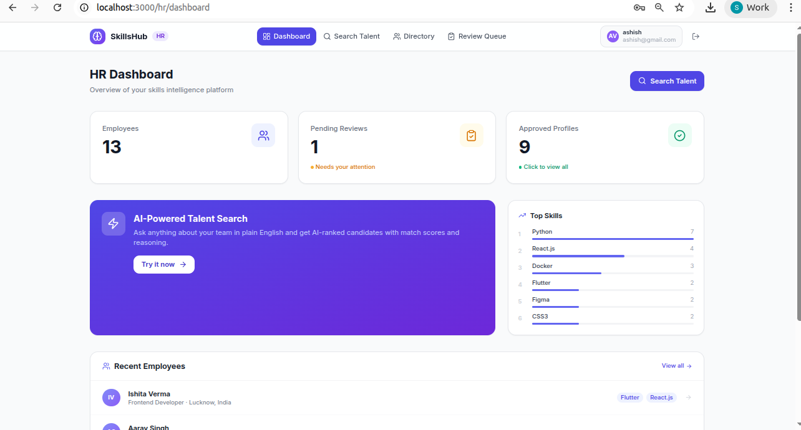

---

## 6. Setup & Installation

### Prerequisites

- Node.js 18+
- `pdftotext` binary (for PDF parsing)

```bash
# Ubuntu / Debian
sudo apt install poppler-utils

# macOS
brew install poppler

# Verify
pdftotext -v
```

### Step 1 — Clone and install

```bash
cd skillhub
npm install
```

### Step 2 — Configure environment

```bash
cp .env.local.example .env.local
```

Edit `.env.local`:

```env
DATABASE_URL="file:./dev.db"
NEXTAUTH_SECRET="<run: openssl rand -base64 32>"
NEXTAUTH_URL="http://localhost:3000"
GROQ_API_KEY="your-groq-api-key"
```

Get a free Groq API key at [console.groq.com](https://console.groq.com).

### Step 3 — Create the database

```bash
DATABASE_URL="file:./dev.db" npx prisma db push
```

> **Note:** Always run Prisma commands from the `skillhub/` directory with the explicit `DATABASE_URL` prefix to target the correct `dev.db` file at the project root, not `prisma/dev.db`.

### Step 4 — (Optional) Seed demo data

```bash
DATABASE_URL="file:./dev.db" npx ts-node --project tsconfig.json prisma/seed.ts
```

### Step 5 — Start the dev server

```bash
npm run dev
```

Open [http://localhost:3000](http://localhost:3000)

---

## 7. Environment Variables

| Variable          |Req  | Description                                          |
|-------------------|-----|------------------------------------------------------|
| `DATABASE_URL`    | Yes | SQLite path — use `file:./dev.db` |
| `NEXTAUTH_SECRET` | Yes | Random secret for JWT signing. Generate: `openssl rand -base64 32`         |
| `NEXTAUTH_URL`    | Yes | App base URL — `http://localhost:3000` for local dev |
| `GROQ_API_KEY`    | Yes | Groq API key from [console.groq.com](https://console.groq.com) |

---

## 8. API Reference

| Method | Endpoint | Auth | Description |
|---|---|---|---|
| POST | `/api/auth/register` | Public | Create new user account |
| GET | `/api/employees` | Any | List employees (supports `?search=` param) |
| GET | `/api/employees/[id]` | Any | Get single employee detail |
| POST | `/api/employees/[id]/skills` | Employee | Add skill manually |
| DELETE | `/api/employees/[id]/skills/[skillId]` | Employee | Remove skill |
| POST | `/api/employees/[id]/projects` | Employee | Add project |
| GET | `/api/profiles` | HR | List profiles (supports `?status=PENDING`) |
| POST | `/api/profiles/approve` | HR | Approve or reject a profile |
| POST | `/api/resume/extract` | Employee | Upload PDF, trigger AI extraction |
| POST | `/api/search` | HR | Natural language talent search |
| POST | `/api/auth/change-password` | Any | Change own password |
| POST | `/api/auth/reset-password` | Public | Password reset flow |

---

## 9. AI Pipeline

### Resume Extraction (`src/lib/extract.ts`)

```
PDF file
  ↓ pdf-parse
Raw text string
  ↓ Groq: llama-3.3-70b-versatile (temp=0.1, max_tokens=4096)
  ↓ Prompt: structured JSON extraction
ExtractedProfile {
  name, email, location, designation, bio, linkedinUrl,
  skills[]: { name, category, proficiency, yearsExp },
  projects[]: { name, description, role, techStack[], startDate, endDate },
  certifications[]: { name, issuer, issueDate },
  inferredSkills[]  ← initially empty, filled by inference rules
}
  ↓ INFERENCE_RULES applied
  ↓ e.g., Next.js found → add React (INTERMEDIATE), JavaScript (LANGUAGE)
Final ExtractedProfile saved to Profile.extractedData as JSON string
```

### Semantic Search (`src/lib/search.ts`)

```
HR query: "Backend dev in Pune with Java experience"
  ↓
semanticSearch(query):
  1. Load all employees with live skills from DB
  2. Build text summary per employee
  3. Groq: rank against query → [{ employeeId, matchScore, reasoning }]
  4. Deduplicate by employeeId (Set)
  5. Return SearchResult[]

(sequential, not parallel)

semanticSearchPending(query):
  1. Load all PENDING profiles with extractedData
  2. Deduplicate — one per employee (most recent)
  3. Build text summary from extractedData JSON
  4. Groq: rank against query → [{ profileId, matchScore, reasoning }]
  5. Return PendingSearchResult[]

Final: filter approved results to exclude employees with pending profiles
```

**Why sequential?** Groq's free tier has rate limits. Two simultaneous LLM calls hit the limit and return 429 errors. Sequential calls (approved first, pending second) stay within limits reliably.

---

## 10. Profile Lifecycle

```
Employee registers
       │
       ▼
  Uploads PDF resume
       │
       ▼
  [PENDING profile created]
  (old PENDING deleted first)
       │
       ├──── HR reviews in Review Queue
       │           │
       │     ┌─────┴─────┐
       │   APPROVE     REJECT
       │     │           │
       │     ▼           ▼
       │  [APPROVED]  [REJECTED]
       │  Skills/projects    Employee sees
       │  written to live    rejection note +
       │  Employee tables    extracted data
       │  LinkedIn URL saved still visible
       │
       └──── Employee can re-upload → new PENDING created
```

**Visibility rules:**

| Who | Sees what |
|---|---|
| Employee | Own profile only. If rejected: banner + extracted data. If pending: "under review" + preview. |
| HR — Directory | All employees, grouped by status. Extracted data shown for pending/rejected with "from resume" tag. |
| HR — Employee Detail | Full detail page. Shows extracted data for pending/rejected with status banner. |
| HR — Search | Approved employees ranked. Pending profiles shown in separate section below. |

---

## 11. Folder Structure

```
skillhub/
├── prisma/
│   └── schema.prisma          ← Database models
├── src/
│   ├── app/
│   │   ├── (auth)/
│   │   │   ├── login/page.tsx
│   │   │   ├── register/page.tsx
│   │   │   └── forgot-password/page.tsx
│   │   ├── (employee)/
│   │   │   ├── layout.tsx            ← Employee route guard
│   │   │   └── employee/
│   │   │       ├── dashboard/page.tsx
│   │   │       ├── profile/page.tsx
│   │   │       └── upload/page.tsx
│   │   ├── (hr)/
│   │   │   ├── layout.tsx            ← HR route guard
│   │   │   └── hr/
│   │   │       ├── dashboard/page.tsx
│   │   │       ├── search/page.tsx
│   │   │       ├── review-queue/page.tsx
│   │   │       ├── approved-profiles/page.tsx
│   │   │       └── employees/
│   │   │           ├── page.tsx      ← Directory
│   │   │           └── [id]/page.tsx ← Detail
│   │   └── api/
│   │       ├── auth/
│   │       │   ├── [...nextauth]/route.ts
│   │       │   ├── register/route.ts
│   │       │   ├── change-password/route.ts
│   │       │   └── reset-password/route.ts
│   │       ├── employees/
│   │       │   ├── route.ts
│   │       │   └── [id]/
│   │       │       ├── route.ts
│   │       │       ├── skills/route.ts
│   │       │       └── projects/route.ts
│   │       ├── profiles/
│   │       │   ├── route.ts
│   │       │   ├── approve/route.ts
│   │       │   └── [id]/route.ts
│   │       ├── resume/
│   │       │   └── extract/route.ts  ← PDF upload + AI extraction
│   │       └── search/route.ts       ← AI talent search
│   ├── components/
│   │   ├── Navbar.tsx
│   │   ├── SkillBadge.tsx
│   │   ├── ResumeUploader.tsx
│   │   ├── SearchResultCard.tsx
│   │   └── ui/                       ← Radix-based primitives
│   ├── lib/
│   │   ├── ai.ts                     ← Groq SDK client factory
│   │   ├── auth.ts                   ← NextAuth config
│   │   ├── db.ts                     ← Prisma client singleton
│   │   ├── extract.ts                ← Resume extraction + inference rules
│   │   ├── search.ts                 ← Semantic search (approved + pending)
│   │   └── utils.ts                  ← Helpers: scoreColor, parseTechStack
│   └── types/
│       └── index.ts                  ← ExtractedProfile, SearchResult, etc.
├── .env.local                        ← Your secrets (git-ignored)
├── .env.local.example                ← Template
└── package.json
```

---

## 12. Demo Credentials

| Role       | Email            |  Password |
|------------|------------------|-----------|
| HR Manager | neha@company.com | neh123    |
| Employee   | ishita@gmail.com | ishita123 |

**To create your own HR account:**
1. Register normally at `/register`
2. Run in Prisma Studio (`npm run db:studio`) or a quick script:
```js
await prisma.user.update({
  where: { email: "you@company.com" },
  data: { role: "HR" }
});
```

---

## Common Issues

**`Error: AI rate limit reached`**
- Groq free tier has request limits.
- If persistent, rotate your `GROQ_API_KEY` from [console.groq.com](https://console.groq.com).

**`pdftotext: command not found`**
- Install `poppler-utils` (Linux) or `poppler` (macOS via Homebrew).

**Prisma migrations not applying**
- Always run from `skillhub/` with explicit DATABASE_URL:
  ```bash
  DATABASE_URL="file:./dev.db" npx prisma db push
  ```

**Skills showing as 0 after profile approval**
- Check that the approval API is writing to the correct `dev.db` file. The runtime app uses `skillhub/dev.db`, not `skillhub/prisma/dev.db`.

---

## 13. Future Improvements

| # | Feature | Description |
|---|---|---|
| 1 | **Dockerized Application** | Package the entire app (Next.js + SQLite + dependencies) into a Docker container. Single `docker-compose up` command to run anywhere — no Node.js or system dependency setup needed |
| 2 | **HR Profile Editing** | Allow HR to directly edit an employee's skill set, add/remove skills, correct proficiency levels, and update project history from the HR employee detail page — without needing employee to re-upload a resume |
| 3 | **PostgreSQL / Supabase Migration** | Replace SQLite with a production-grade PostgreSQL database for multi-user concurrency, cloud hosting, and team collaboration. Prisma makes this a one-line provider change |
| 4 | **Slack / Email Notifications** | Notify employees when their resume is approved or rejected. Notify HR when a new resume is submitted. Keeps all parties informed without checking the app |
| 5 | **Resume Re-upload with Diff View** | When an employee re-uploads a resume, show HR a side-by-side diff of old vs new extracted skills so reviewers can quickly see what changed and approve faster |

---

*Built for hackathon — AI-Powered Skills Intelligence Platform*
